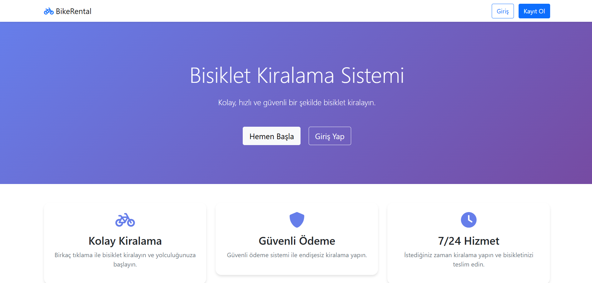
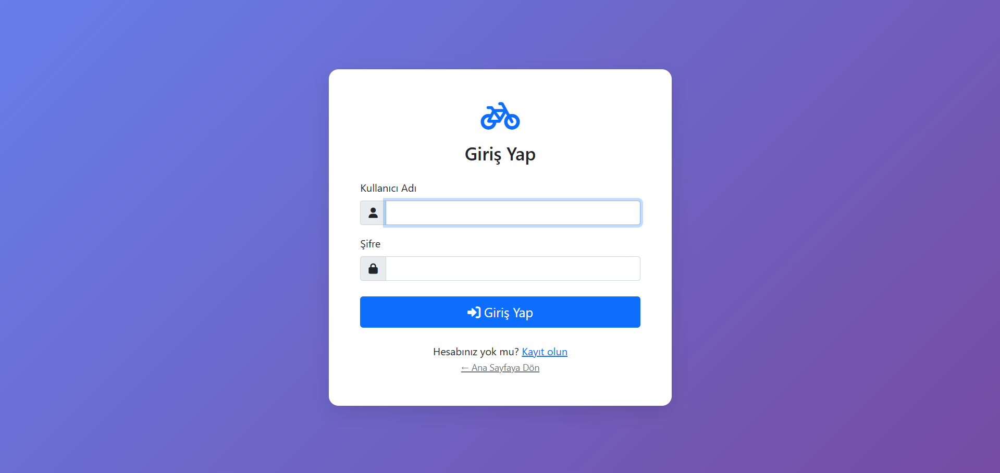
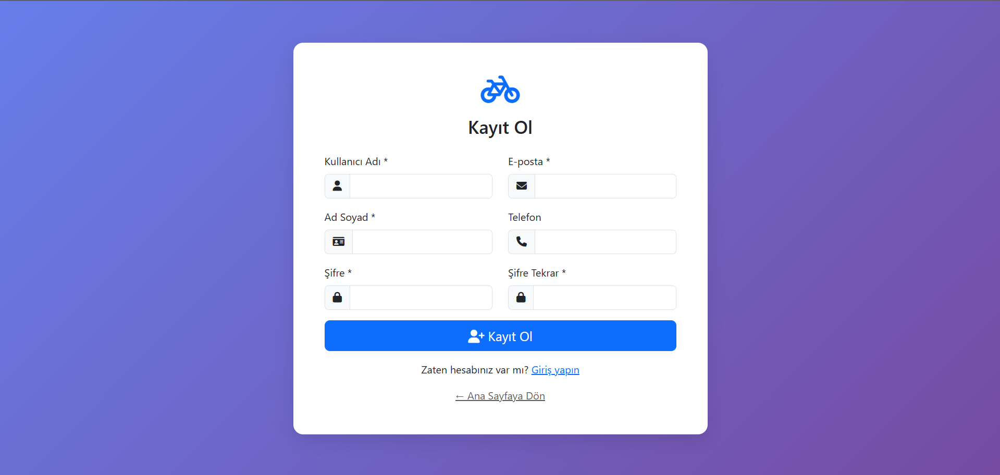
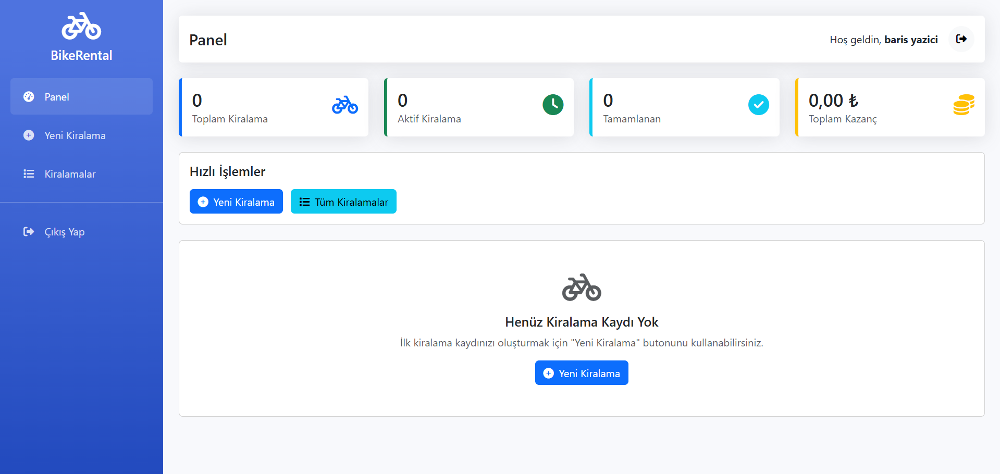
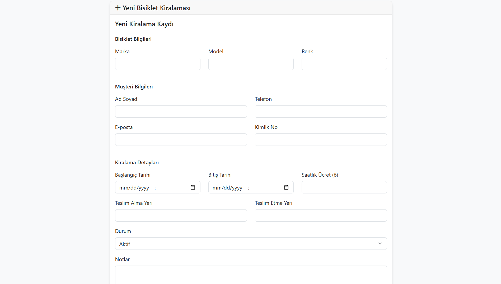
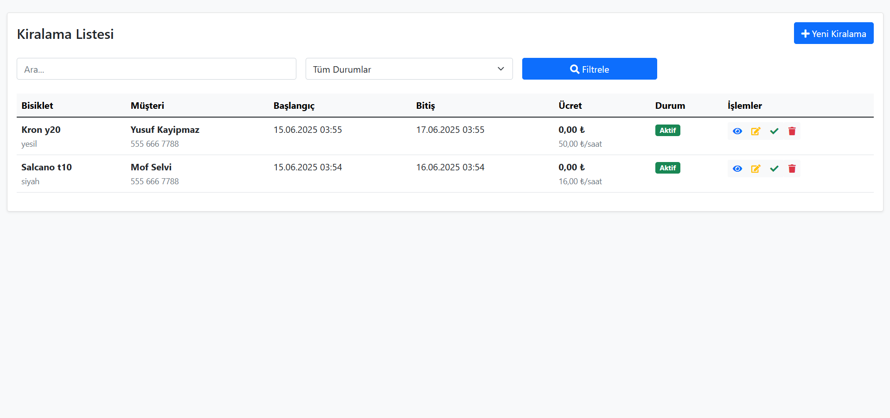
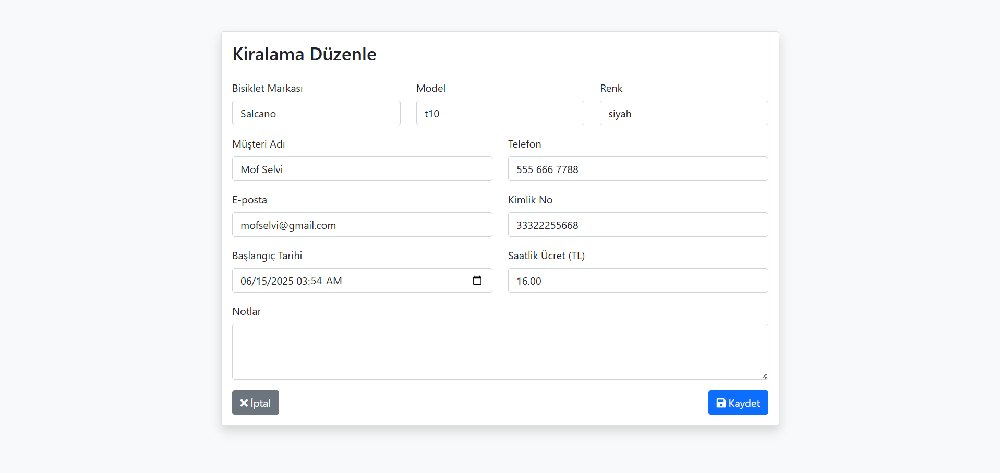
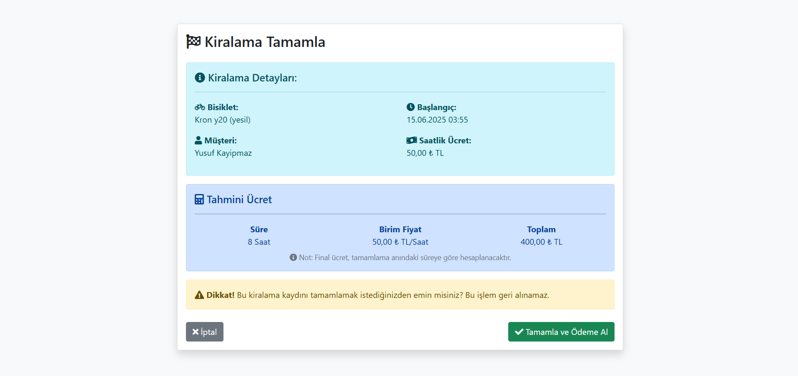

# BikeRental

Bu proje, bir bisiklet kiralama işletmesi için geliştirilen basit ve güvenli bir web tabanlı takip sistemidir. Kullanıcılar sisteme kayıt olabilir, giriş yapabilir ve kiralama işlemlerini yönetebilir.

##  Özellikler

-  Kullanıcı kaydı ve oturum açma (şifreler hash'li olarak veritabanına kaydedilir)
-  Kiralama işlemleri: ekleme, listeleme, düzenleme, silme
-  Son giriş zamanı takibi
-  Bootstrap 5 ile responsive arayüz
-  PDO ile güvenli veritabanı işlemleri (SQL enjeksiyon korumalı)
-  Şifre doğrulama ve güçlü parola kontrolü

## Ekran Görüntüleri

##  Kullanılan Teknolojiler

- PHP (Backend)
- MySQL (Veritabanı)
- HTML5, CSS3, Bootstrap 5 (Frontend)
- JavaScript (isteğe bağlı dinamik içerikler için)

##  Proje Yapısı

├── index.php → Giriş sayfası

├── register.php → Kayıt formu

├── dashboard.php → Giriş sonrası kontrol paneli

├── add_rental.php → Kiralama ekleme formu

├── list_rentals.php → Kayıt listesi

├── edit_rental.php → Kayıt düzenleme

├── delete_rental.php → Silme işlemi

├── logout.php → Oturum sonlandırma

├── config.php → Veritabanı bağlantı ayarları

├── classes/

│ └── User.php → Kullanıcı işlemleri (register, login vb.)

└── database_setup.sql → Veritabanı tablo yapısı

##  Güvenlik

- Şifreler PHP’nin password_hash() fonksiyonu ile güvenli biçimde saklanır.
- Giriş işlemleri password_verify() ile doğrulanır.
- Tüm sorgular PDO prepared statements ile yapılır.
- XSS'e karşı girişlerde strip_tags, htmlspecialchars ve trim kullanılır.
